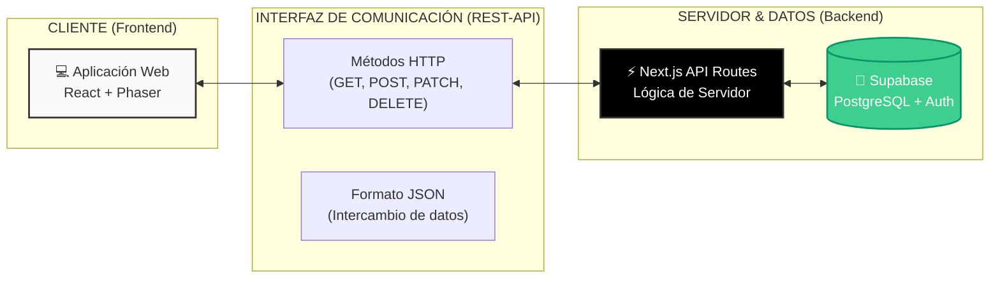

# 🎓 English27 - Sistema Educativo Gamificado

> Plataforma web para el aprendizaje de inglés con gamificación, desarrollada con Next.js, TypeScript y Supabase.

[](https://nextjs.org/)
[](https://www.typescriptlang.org/)
[](https://supabase.com/)
[](https://tailwindcss.com/)

---

## 📋 Tabla de Contenidos

- [Características](#-características)
- [Arquitectura](#-arquitectura)
- [Instalación](#-instalación)
- [Estructura del Proyecto](#-estructura-del-proyecto)
- [Tecnologías](#-tecnologías)
- [Documentación](#-documentación)
- [Desarrollo](#-desarrollo)

---

## ✨ Características

### 👨‍🎓 Para Estudiantes
- 📊 Dashboard personalizado con progreso
- 🎯 Sistema de niveles y puntos
- 📚 Actividades asignadas por docentes
- 🏆 Sistema de recompensas
- 📈 Seguimiento de progreso en tiempo real

### 👨‍🏫 Para Docentes
- 📝 Creación de actividades gamificadas
- 👥 Gestión de estudiantes
- 📊 Reportes de progreso
- 🎯 Asignación de actividades
- 💬 Sistema de mensajería

### 👨‍💼 Para Administradores
- 🔐 Gestión completa de usuarios
- 📊 Estadísticas del sistema
- ✅ Aprobación de cuentas
- 🛡️ Control de roles y permisos
- 📈 Métricas y analytics

### 🌍 Características Generales
- 🌐 Multiidioma (Español/Inglés)
- 🎨 Interfaz moderna y responsive
- 🔒 Autenticación segura
- ⚡ Rendimiento optimizado
- 📱 Mobile-friendly

---

## 🏗️ Arquitectura

### Clean Architecture
```
┌─────────────────────────────────────┐
│         Presentation Layer          │
│    (Components, Pages, UI)          │
├─────────────────────────────────────┤
│         Business Logic Layer        │
│    (Hooks, Context, Utils)          │
├─────────────────────────────────────┤
│         Data Access Layer           │
│    (Services, API Calls)            │
├─────────────────────────────────────┤
│         External Services           │
│    (Supabase, APIs)                 │
└─────────────────────────────────────┘
```

### Arquitectura REST-API
Visualización de la interacción entre el cliente, la interfaz de comunicación y el servidor de datos:



### Patrones Implementados
- ✅ **Service Layer Pattern** - Capa de servicios para API
- ✅ **Custom Hooks Pattern** - Lógica reutilizable
- ✅ **Component Composition** - Componentes pequeños y enfocados
- ✅ **Repository Pattern** - Abstracción de datos
- ✅ **Provider Pattern** - Contextos de React

---

## 🚀 Instalación

### Prerrequisitos
- Node.js 18+ 
- npm o yarn
- Cuenta de Supabase

### Pasos

1. **Clonar el repositorio**
```bash
git clone <repository-url>
cd appWebIngles
```

2. **Instalar dependencias**
```bash
npm install
```

3. **Configurar variables de entorno**
```bash
# Crear archivo .env.local
NEXT_PUBLIC_SUPABASE_URL=tu_supabase_url
NEXT_PUBLIC_SUPABASE_ANON_KEY=tu_supabase_anon_key
```

4. **Ejecutar migraciones de base de datos**
```bash
# Las migraciones están en /supabase/migrations/
# Ejecutar en Supabase Dashboard o con CLI
```

5. **Iniciar servidor de desarrollo**
```bash
npm run dev
```

6. **Abrir en navegador**
```
http://localhost:3000
```

---

## 📁 Estructura del Proyecto

```
appWebIngles/
├── app/                          # Next.js App Router
│   ├── layout.tsx               # Layout principal
│   └── page.tsx                 # Página principal
│
├── src/
│   ├── types/                   # Tipos TypeScript
│   │   ├── user.types.ts
│   │   ├── activity.types.ts
│   │   └── index.ts
│   │
│   ├── services/                # Capa de servicios (REST API)
│   │   ├── auth.service.ts
│   │   ├── user.service.ts
│   │   ├── activity.service.ts
│   │   └── progress.service.ts
│   │
│   ├── hooks/                   # Custom hooks
│   │   ├── useActivities.ts
│   │   ├── useProgress.ts
│   │   └── useUsers.ts
│   │
│   ├── components/
│   │   ├── ui/                  # Componentes base
│   │   │   ├── Card.tsx
│   │   │   ├── Badge.tsx
│   │   │   └── LoadingSpinner.tsx
│   │   │
│   │   ├── layout/              # Layouts
│   │   │   └── DashboardNav.tsx
│   │   │
│   │   └── features/            # Features
│   │       ├── auth/
│   │       └── dashboard/
│   │
│   ├── contexts/                # React Contexts
│   │   ├── AuthContext.tsx
│   │   └── LanguageContext.tsx
│   │
│   ├── lib/                     # Utilidades
│   │   ├── supabase.ts
│   │   └── utils/
│   │
│   ├── config/                  # Configuración
│   │   └── constants.ts
│   │
│   └── i18n/                    # Internacionalización
│       └── translations.ts
│
├── public/                      # Archivos estáticos
│   └── images/
│
├── supabase/                    # Migraciones DB
│   └── migrations/
│
└── docs/                        # Documentación
    ├── REFACTORIZACION.md
    ├── GUIA_MIGRACION.md
    └── EJEMPLOS_CODIGO.md
```

---

## 🛠️ Tecnologías

### Frontend
- **Next.js 15** - Framework React con App Router
- **React 19** - Librería UI
- **TypeScript 5.5** - Type safety
- **Tailwind CSS 3.4** - Estilos
- **Lucide React** - Iconos

### Backend
- **Supabase** - Backend as a Service
  - PostgreSQL Database
  - Authentication
  - Row Level Security (RLS)
  - Real-time subscriptions

### Herramientas
- **ESLint** - Linting
- **Prettier** - Formateo de código
- **Git** - Control de versiones

---

## 📚 Documentación

### Documentación Técnica
- [REFACTORIZACION.md](./REFACTORIZACION.md) - Arquitectura y patrones
- [GUIA_MIGRACION.md](./GUIA_MIGRACION.md) - Guía de migración
- [EJEMPLOS_CODIGO.md](./EJEMPLOS_CODIGO.md) - Ejemplos prácticos
- [RESUMEN_EJECUTIVO.md](./RESUMEN_EJECUTIVO.md) - Resumen del proyecto
- [API_REST_ESTANDAR.md](./docs/API_REST_ESTANDAR.md) - ✅ Estándar API REST

### Documentación de Migración
- [MIGRACION_NEXTJS.md](./MIGRACION_NEXTJS.md) - Migración a Next.js
- [INTEGRACION_I18N.md](./INTEGRACION_I18N.md) - Internacionalización

---

## 💻 Desarrollo

### Scripts Disponibles

```bash
# Desarrollo
npm run dev          # Iniciar servidor de desarrollo

# Producción
npm run build        # Construir para producción
npm run start        # Iniciar servidor de producción

# Calidad de código
npm run lint         # Ejecutar ESLint
npm run format       # Formatear con Prettier (si está configurado)

# TypeScript
npx tsc --noEmit     # Verificar tipos
```

### Convenciones de Código

#### Nombres de Archivos
- Componentes: `PascalCase.tsx`
- Hooks: `useCamelCase.ts`
- Servicios: `camelCase.service.ts`
- Tipos: `camelCase.types.ts`

#### Imports
```typescript
// Usar path aliases
import { Component } from '@/components/ui/Component';
import { useHook } from '@/hooks/useHook';
import type { Type } from '@/types';
```

#### Componentes
```typescript
// Componentes funcionales con TypeScript
interface Props {
  title: string;
  onAction: () => void;
}

export function Component({ title, onAction }: Props) {
  return <div>{title}</div>;
}
```

---

## 🔐 Roles y Permisos

### Estudiante
- ✅ Ver su propio progreso
- ✅ Acceder a actividades asignadas
- ✅ Completar actividades
- ❌ No puede crear actividades
- ❌ No puede ver otros estudiantes

### Docente
- ✅ Crear actividades
- ✅ Asignar actividades a estudiantes
- ✅ Ver progreso de sus estudiantes
- ✅ Generar reportes
- ❌ No puede gestionar usuarios

### Administrador
- ✅ Gestión completa de usuarios
- ✅ Aprobar/rechazar cuentas
- ✅ Ver estadísticas globales
- ✅ Acceso a todas las funcionalidades
- ✅ Gestionar roles y permisos

---

## 🌐 Internacionalización

El sistema soporta múltiples idiomas:
- 🇪🇸 Español (por defecto)
- 🇬🇧 Inglés

### Agregar nuevas traducciones
```typescript
// src/i18n/translations.ts
export const translations = {
  es: {
    nuevaClave: 'Texto en español',
  },
  en: {
    nuevaClave: 'Text in English',
  },
};
```

---

## 🧪 Testing (Próximamente)

```bash
# Tests unitarios
npm run test

# Tests con coverage
npm run test:coverage

# Tests E2E
npm run test:e2e
```

---

## 📈 Roadmap

### ✅ Fase 1 - Completada
- [x] Arquitectura base
- [x] Tipos centralizados
- [x] Capa de servicios REST 100% consistente
- [x] Custom hooks
- [x] Componentes UI base
- [x] Dashboard Estudiante
- [x] Cliente Supabase estandarizado

### 🚧 Fase 2 - En Progreso
- [ ] Dashboard Docente refactorizado
- [ ] Dashboard Admin refactorizado
- [ ] Componentes de autenticación
- [ ] Optimización de imágenes

### 📅 Fase 3 - Planificada
- [ ] Validación de formularios
- [ ] Tests unitarios
- [ ] Tests E2E
- [ ] React Query
- [ ] Optimizaciones de rendimiento

---

## 🤝 Contribuir

### Flujo de Trabajo
1. Fork el proyecto
2. Crear rama feature (`git checkout -b feature/AmazingFeature`)
3. Commit cambios (`git commit -m 'Add AmazingFeature'`)
4. Push a la rama (`git push origin feature/AmazingFeature`)
5. Abrir Pull Request

### Estándares
- Seguir convenciones de código
- Agregar tests para nuevas features
- Actualizar documentación
- Usar commits descriptivos

---

## 📄 Licencia

Este proyecto es privado y está desarrollado para uso educativo.

---

## 👥 Equipo

Desarrollado para la Unidad Educativa Delice

---

## 📞 Soporte

Para soporte y preguntas:
- 📧 Email: [contacto]
- 📚 Documentación: Ver carpeta `/docs`
- 🐛 Issues: [GitHub Issues]

---

## 🙏 Agradecimientos

- Next.js Team
- Supabase Team
- Comunidad de React
- Tailwind CSS Team

---

**Última actualización**: 2024
**Versión**: 2.0.0
**Estado**: 🟢 Activo
